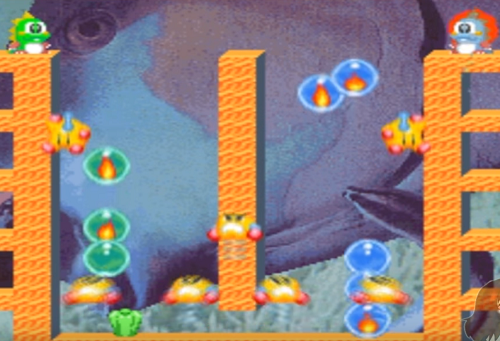

Bubble Bobble
=============

Analize of Game Contents
------------------------

    
     
 >**2018-01 게임의 이해 보고서**  
   **날짜 : 2017/04/15**  
> **학번 : 201720697**  
> **제출자 : 강형국**

Index
=====

Chapter1. Game Summary
----------------------

-	### Basic Information
-	### Overview

Chapter2. Synopsis
------------------

-	### 기획 의도
-	### 세계관
-	### Main Concept

Chapter3. Feature
-----------------

-	### Double Player Game(2P)

Chapter4. Critical Reception
----------------------------

Chapter5. Game Play
-------------------

-	### Game Start
-	### Game
-	### Items of Game

Chapter6. Game Rule
-------------------

Chapter7. Level & Map Design
----------------------------

Chapter8. Graphics User InterFace
---------------------------------

-	### Score Board
-	### Main Game Screen

Chapter.9 Compare with Later Version
------------------------------------

-	### Same Part : Condition to Win  
-	### Same Part : Way of Playing Game
-	### Different Part : Elements of Game

Chapter.10 Credits
------------------

-	### Programmer
-	### Character
-	### Sound
-	### Planner
-	### Special Thanks To..
-	### Producer

Chapter.11 References
---------------------

  

Chapter1. Game Summary
======================

Basic Informaion
----------------

> Publisher　　　Taito  
> Developer　 　 Taito  
> Release Date　 August 1986 (At Japan)  
> 　　　　　　　October 1986 (At USA)  
> 　　　　　　　June 10th 1986 (At Korea)  
> ESRB Rating　 Not evaluated  
> Genre 　　　　Comical Action Platformer  
> Perspective　　2-Dimensional, 256x224,60Hz, 256colors

OverView
--------

> ***Bubble Bobble*** 은 Taito 사에서 1986년도에 출시하여 엄청난 성공을 거둔 아케이드 게임으로 여러 컴퓨터 및 콘솔에서 일찍 포팅되었으며, 국내에서는 보블보플이라는 이름보다는 보글보글 이라는 이름으로 더 널리 알려져있다. 간단한 조작과 귀여운 캐릭터 디자인으로 인하여 남녀노소를 가리지 않고 인기가 많았고, 여러 여성 게임 플레이어들을 많이 등장시키게 된 게임으로 게임 역사에서 의의가 깊다.  
>  본 게임을 디자인한 사람은 MTJ, 미츠지 후키오로서 ***Bubble Bobble***, ***Rainbow Island*** 등의 타이토의 명작 게임들을 만든 사람으로서 게임을 매우 사랑하여 "인생을 다 바쳐도 한 사람이 만들 수 있는 게임은 한정되어 있다. 나는 한 그루의 나무가 되기보다는 나무 심는 사람이 되고 싶다." 라는 말도 남겼으며 이스터 에그[1]를 포함해서 화면에 표시된 모든 것들을 게이머들이 적극적으로 활용할 수 있는 점을 부각하였고 숨겨진 커멘드를 입력하여 슈퍼 모드를 발동시키고 플레이를 할 경우 진짜 엔딩을 볼 수 있도록 비밀스럽게 설계하여 버블보블 마니아까지 생겨나며 폭발적인 인기를 발생시키는 원인이 되었다.  
>   아래의 링크는 Taito 사의 공식 홈페이지이며 아직도 인기있는 ***Bubble Bobble*** 의 귀여운 캐릭터 성을 살려 ***Bust-A-Move Journey / Puzzle Bobble Journey*** 같은 게임을 제작하고 있음을 알 수 있다.

　Taito 사의 공식 홈페이지 : https://www.taito.com/  
　[1] : 이스터 에그, 프로그래머가 프로그램에 이용자들 몰래 자신만의 장난을 쳐 놓는 행위

Chapter2. Synopsis
==================

기획 의도
---------

***Bubble Bobble*** 는 재앙에 휘말린 플레이어들이 능동적으로 움직여 재앙의 원인을 해결하는 과정에서의 악당들을 물리치며 최종단계를 향하며 점점 어려워지는 스테이지를 해결해 나가면서 희열을 느낄수 있도록 만들어진 아케이드 게임이다.

세계관
------

#### 원본 및 번역본

> "Baron Von Blubba" has kidnapped the brothers Bubby and Bobby's girlfriends and turned the brothers into Bubble Dragons, Bub and Bob. they have to finish 100 levels in the Cave of Monsters in order to rescue them.  
> 번역하자면 "Baron Von Blubba"라는 악당이 Bubby와 Bobby의 여자친구를 납치한 뒤 그 둘을 버블공룡으로 만들어 버려 여자친구를 되찾기 위하여 그 둘이 탑을 100층의 몬스터로 가득 찬 미궁을 클리어하는 것이다.   
> 여기까지가 제작사에서 공개한 ***Bubble Bobble*** 의 세계관이다. 그러나 이스터에그를 활용하여 게임을 분석한 매니아들에 의하여 클리어한 최종보스의 정체는 악당 "Baron Von Blubba"가 아니라 바로 부모님이었고 그의 마법에 걸려 용이 된 주인공의 부모님을 구하면 진짜 엔딩을 볼 수 있다. 아이러니하게도 그냥 플레이 시 최종보스를 섬멸하고 끝나게 되는데, 그렇게 되면 주인공들의 부모님들은 죽는다는 예기가 된다.

Main Concept
------------

#### 커플을 게임 이용 대상으로 하여 성공한 게임

> 특징에서 후술할 계획이지만 이 게임은 2명 이하의 플레이어의 동시 게임 플레이를 지원한다. 또한 귀여운 캐릭터 및 몬스터 디자인으로 인하여 여성 플레이어들의 마음을 움직였고, 오락성 측면에서 또한 뛰어나므로 **남성 플레이어** 는 두말할 필요도 없이 좋아하게 되었고 그 결과 커플이 쉽게 즐길 수 있는 게임이 되어 대성공을 거두게 되었다.

Chapter3. Feature
=================

Chapter4. Critical Reception
============================

Chapter5. Game Play
===================

Chapter6. Game Rule
===================

Chapter7. Level & Map Design
============================

-	### Stage Design 

##### ***Bubble Bobble*** 에서 1층에서부터 100층까지의 Stage 생김새

> ***Bubble Bobble*** 에는 1층부터 100층까지 총 100개의 Stage가 있고 이중 마지막 100번 방에는 해당 게임을 클리어 할 수 있는 최종 보스가 존재한다. 각각의 Stage을 구성하는 요소는 **플레이어, 몬스터, 벽돌, 구멍, 스폰방울** 이다. 이들을 조합하여 무수하게 많은 종류의 스테이지를 만들어 낼 수 있다.

-	### Design of Chracters, Monsters, Elements  
	  
	
	Character, 좌:Player1 우: Player2  

##### ***Bubble Bobble*** 의 주인공

> ***Bubble Bobble*** 의 주인공이자 플레이어들이 움직이는 캐릭터이다. 좌,우 점프를 할 수 있으며 방울을 발사하여 적들을 방울 안에 가둘 수 있다. 방울에 가둔 적을 터트려 나오는 아이템으로 점수를 획득하게 되며, 처음에 일정량의 생명을 가지고 시작하고 게임 중에 등장하는 알파벳들을 모아서 추가 생명을 획득할 수 있다.

　　　　　　　　　　　　  
　　　　　　　　　　　　

##### ***Bubble Bobble*** 의 몬스터

> Bubble Bobble에서 플레이어들의 클리어를 방해하는 역할을 맡은 몬스터들이다.(좌측 상단부터 우측 하단까지 드렁크, 푸루푸루, 히데콘스, 마이타, 몬스타, 바네보, 인베이더, 젠짱)이다. 이 몬스터들은 각각의 독특한 능력을 가지고 있다. 불을 뿜거나, 날아다니거나, 점프를 높이 하거나 등등 이러한 몬스터의 조합만으로도 디자인할 수 있는 스테이지는 무궁무진하다.

　　　　　　　　　  
	 
##### ***Bubble Bobble*** 의 특수 몬스터

> ***Bubble Bobble*** 에는 일반적인 몬스터도 많지만 게임의 플레이에 더욱 방대하고 직접적인 영향을 미치고 특수한 행동을 하도록 설계된 몬스터틀이 존재한다 우측부터(라스칼, 스컬 몬스타, 슈퍼 드렁크)이다. 우선 이 몬스터들은 크게 두 가지로 분류할 수 있다.  
>  - #### 보스 몬스터  
> 이에 해당하는 몬스터는 슈퍼 드렁크로서 이 게임의 최종 보스 역할을 하고 있다.
>
> -	#### 영파[1]  
> 	방지 몬스터 플레이어의 영파를 방지하기 위해서 플레이어가 일정 시간 동안 한 스테이지를 클리어하지 못하면(보스 몬스터 제외) 등장하는 몬스터로서 무적이며 공중을 날아다니고 플레이어와 접촉하여 플레이어의 사망을 유발한다. 이에 대항되는 몬스터로써는 ***스컬 몬스타*** 와 ***라스칼*** 이 있는데 이중 일반적인 스테이지에서의 영파 방지는 ***스컬 몬스타*** 가 책임지고 해결하고, 특수 및 보너스 스테이지에서는 ***라스칼*** 이 영파 방지 몬스터 역할을 수행하게 된다.

　[1] : 영구 파밍의 줄임말로써 플레이어가 기록갱신을 위하여 한 스테이지에 머물러 점수를 올리는 행위 

Chapter8. Graphics User InterFace
=================================

Game Main Screen 구성
---------------------

  
 **Total Game Scene**

#### 2-Dimensional 게임이며 게임 화면은 크게 점수판과 플레이 화면으로 구성되어 있다.

### Score Board

-	Player1과 Player2의 개별 점수 및 지금까지의 최고 점수를 나타낸다. 

### Main Game Screen

-	Player and Monsters

	-	플레이어는 혼자 플레이 할 경우 녹색 공룡(Player1)과 2인 플레이를 할 경우 청색 공룡(Player2)가 추가된다. 또한 몬스터가 매 Stage마다 바뀌며 게임에서의 질림을 방지한다.

-	좌, 우측 벽

	-	플레이어 및 몬스터의 행동을 제한한다. 또한 플레이어의 현재 남은 생명의 갯수, Stage Number(좌측 상단) 플레이어가 수집한 알파벳의 현황을 나타낸다.

-	발판

	-	플레이어의 y축 생동 범위를 넓히기 위하여 플레이어가 밟고 올라갈 수 있는 막대기이다. 맵의 구조를 결정하는 요인 중 하나이다.

-	구멍

	-	맵 상단과 연결되어 창의적인 플레이어 동선을 유발하여 행동할 수 있는 경우의 수를 증가시킨다.

Chapter.9 Compare with Later Version
====================================

### ***Bubble Bobble*** 의 후속편

> ***Bubble Bobble*** 은 첫번째부터 세번째까지의 세 개의 버젼이 있다. 두 번째인 ***Bubble Symphony*** 와 세 번째인 ***Bubble Memories*** 에서는 전작과는 다르게 미궁을 내려가는 것이 아니라 탑을 올라가는 형태의 스토리로 바뀌었다. 또한 플레이어가 선택 가능한 캐릭터의 수가 증가하였으며 각 캐릭터 별 고유 능력치도 다르게 출시되었다. 게다가 3편의 경우에는 세계관이 변경된다.   
> 　  
> **Bubble Bobble Symphony** 　　　　　　　　　　**Bubble Boble Memories**

### **동일한 기본구도 : 승리조건**

> 두 개의 후속작 ***Bubble Symphony*** 와 ***Bubble Memories*** 모두 정해진 갯수의 스테이지를 모든 목숨 소진 없이 해결하고 최종 보스를 클리어하여야 게임에서의 승리를 거머쥘 수 있다는 특징이 있다.

### **동일한 기본개념 : 게임 플레이 방식**

> 전작과 마찬가지로 플레이어는 적들을 방울에 가둔 뒤 방울을 터트려서 완전히 적을 죽여야 한다. 일정 시간이 지나게 되면 방울 안의 적들이 다시 풀려나며, 제한 시간 안에 스테이지를 클리어하지 못하면 발생하게 되는 적들의 버서커 모드와 점수만을 올리고 스테이지 진행을 하지 않는 꼼수를 방지하기 위한 고스트가 출몰하게 된다. 또한 기본적인 아이템과 효과들도 동일하다.

### **전작과의 차이점 : 게임 플레이 요소**

> 기본적으로 전작들과의 차이를 줄이기 위하여 큰 변화는 주지 않았지만 스테이지의 구성이 ***Bubble Symphony*** 의 경우 총 51스테이지로 스테이지의 개수가 확 줄어들었으며 이어지는 후속편인 ***Bubble Memories*** 에서는 전작보다는 늘었지만 초기작보다는 여전히 작은 80개의 스테이지로 구성되게 된다. 또한 가장 큰 차이점으로는 보스의 개수가 증가하였고 각 보스마다 해당 스테이지까지 향하기까지의 특색이 추가되었다. 캐릭터가 공격키를 꾹 누르고 있으면 거대한 방울을 발사하여 여러 명의 적을 가두고 몬스터로부터 나오는 아이템의 점수가 증가하는 부분 캐릭터 선택의 폭이 증가한 것도 하나의 변화이다. 초기작 ***Bubble Bobble*** 과는 다르게 ***Bubble Symphony*** 에서는 총 4개의 캐릭터 **Bubblun, Bobblun, Kululun, Cororon** 의 연두, 파랑, 노랑, 분홍의 캐릭터들로 바뀌게 되었으며, 각각의 능력치가 다르게 설정되었다.   
>  
>
> ##### **Bubble Symphony 의 캐릭터들** 　　　　　　　　　**Bubble Memories의 모아쏘기**
>
> -	Bubblun  
> 	기본적인 캐릭터이며 평균적인 능력치이다. 모아쏘기를 할 경우 3개의 버블이 동시에 사출된다.  
> -	Bobblun  
> 	　이동속도가 빠른 반면 버블의 사정거리가 감소하였다, 모아쏘기를 할 경우 3개의 버블이 전방 3방향으로 사출된다.  
> -	Kululun  
> 	　버블의 사정거리가 긴 대신 발사된 버블의 속도가 느린 편이다, 모아쏘기를 할 경우 버블이 앞, 뒤, 아래로 사출된다.  
> -	Cororon  
> 	발사되는 버블의 속도가 빠른 대신 이동속도가 감소하였다, 모아쏘기를 할 경우 버블이 앞, 뒤, 위로 사출된다.  
>
> 
>
> #### 속성 방울 중 불 속성 방울
>
> 전작과의 또 다른 차이점으로는 스테이지의 창의적인 해결법을 제시하는 각종 **"속성방울"** 들의 등장이다. 이는 보스전에서 크게 활약을 하기도 하고, 일반적인 스테이지라도 창의적인 플레이를 요구하도록 한다.

Chapter.10 Credits
==================

> -	### Programmer
> 	-	##### S. Takahashi
> 	-	##### Drunker. Kzm
> 	-	##### Yuichiro. Kawamuki
> -	### Character
> 	-	##### Shinobu. I
> -	### Sound
> 	-	##### Shotaro
> 	-	##### Ogr, Takagi
> 	-	##### Composer Kimi
> -	### Planner
> 	-	##### Sleepy. Shun
> -	### Special Thanks To..
> 	-	##### MTJ, I.F (미츠키 후키오)
> 	-	##### Kazuya. Tatuya
> 	-	##### Omake Tanaka
> -	### Producer
> 	-	##### S. Takahashi
> 	-	##### P.M.D.C. 

  

Chapter.11 References
=====================

### Web

-	Wikipedia. Bubble Bobble
	-	https://en.wikipedia.org/wiki/Bubble_Bobble (English Ver.)  
	-	https://ko.wikipedia.org/wiki/버블_보블 (Korean Ver.)  
-	나무위키. 버블보블
	-	https://namu.wiki/w/버블보블
-	Bubble Bobble - Nintendo NES system (Play Game Link)
	-	http://www.retrogames.cz/play_216-NES.php  
-	Bubble Bobble level guide
	-	http://www.adamdawes.com/retrogaming/bbguide/
-	Promoted: Bubble Bobble is the stupidest game ever (Used at Critical Reception)
	-	https://www.destructoid.com/promoted-bubble-bobble-is-the-stupidest-game-ever-495148.phtml
